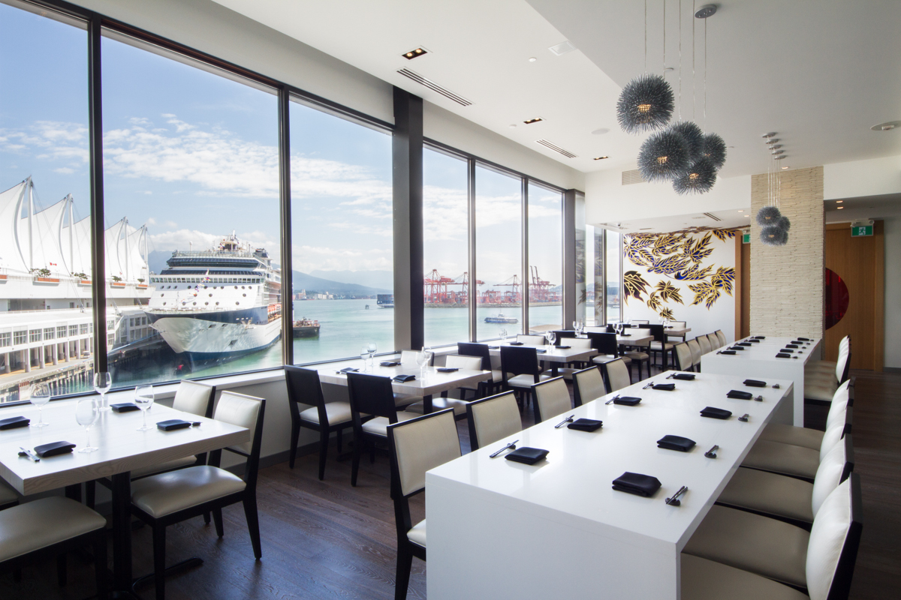
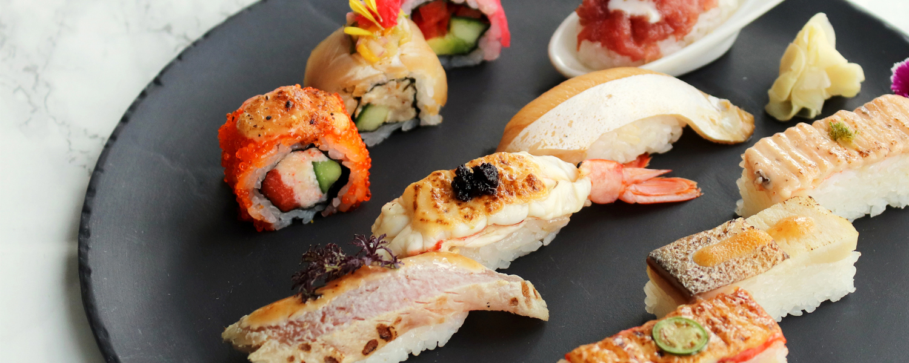
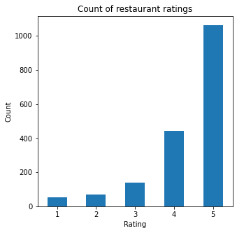
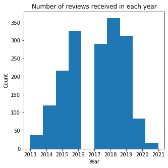
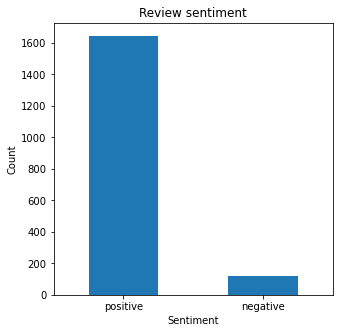
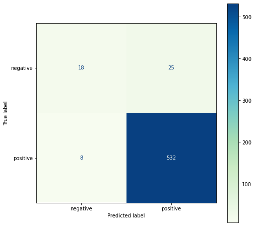
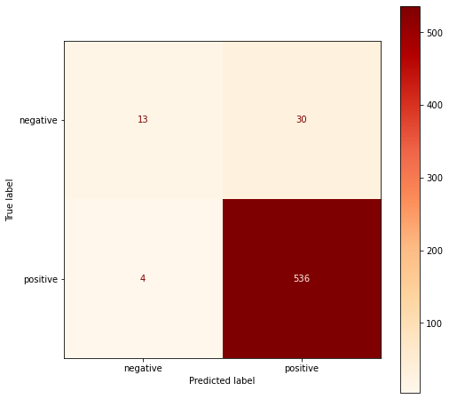
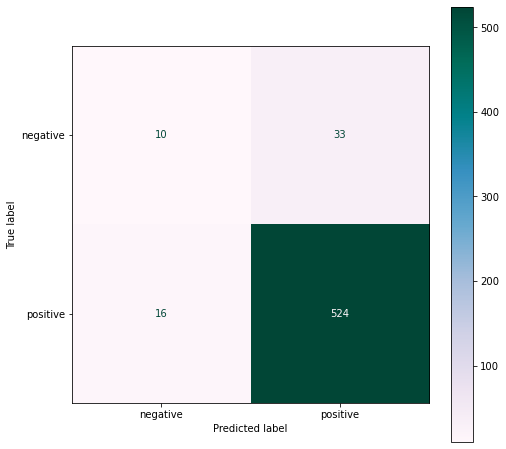

# [<span style="color:black">Sentiment Analysis on Yelp Restaurant Reviews</span>](https://www.yelp.ca/biz/miku-vancouver-2)
[<span style="color:darkred">Miku Waterfront- Vancouver BC </span>](https://mikurestaurant.com)
 
   
       
<br/>
<br/>


Roy Wu      
June, 2021     

 

 <font size="1"> [<span style="color: grey"> image source: Tourism Vancouver</span>](https://www.tourismvancouver.com/listings/miku-restaurant/20541/)</font>

 

<font size="1"> [<span style="color: grey"> image source: Miku Vancouver</span>](https://mikurestaurant.com)</font> 

### Import libraries and the dataset


```python
import pandas as pd
import numpy as np
import matplotlib.pyplot as plt
import seaborn as sns
import re
import nltk
```


```python
miku = pd.read_csv(
    '/Users/roywu/Documents/Project/miku.csv',
    names=['name', 'location', 'comment', 'date', 'rating'],
    index_col=0,
    delimiter=',')
```

### Exploratory Data Analysis


```python
miku
```


<div>
<style scoped>
    .dataframe tbody tr th:only-of-type {
        vertical-align: middle;
    }

    .dataframe tbody tr th {
        vertical-align: top;
    }

    .dataframe thead th {
        text-align: right;
    }
</style>
<table border="1" class="dataframe">
  <thead>
    <tr style="text-align: right;">
      <th></th>
      <th>name</th>
      <th>location</th>
      <th>comment</th>
      <th>date</th>
      <th>rating</th>
    </tr>
  </thead>
  <tbody>
    <tr>
      <th>0</th>
      <td>Justin K.</td>
      <td>Richmond, BC</td>
      <td>Went for New Year's Eve dinner and as always, ...</td>
      <td>3/16/2021</td>
      <td>5 star rating</td>
    </tr>
    <tr>
      <th>1</th>
      <td>Colin W.</td>
      <td>San Francisco, United States</td>
      <td>Hands down, the best place in town for high qu...</td>
      <td>4/19/2021</td>
      <td>5 star rating</td>
    </tr>
    <tr>
      <th>2</th>
      <td>Katy E.</td>
      <td>Vancouver, BC</td>
      <td>Expensive but great quality fish. They've redu...</td>
      <td>9/23/2020</td>
      <td>5 star rating</td>
    </tr>
    <tr>
      <th>3</th>
      <td>Melody T.</td>
      <td>Vancouver, BC</td>
      <td>DELICIOUS AND FRESH! I always love Miku everyt...</td>
      <td>4/3/2021</td>
      <td>5 star rating</td>
    </tr>
    <tr>
      <th>4</th>
      <td>Celina H.</td>
      <td>Vancouver, BC</td>
      <td>About 3 yrs ago, 5 of us were having dinner at...</td>
      <td>2/19/2021</td>
      <td>1 star rating</td>
    </tr>
    <tr>
      <th>...</th>
      <td>...</td>
      <td>...</td>
      <td>...</td>
      <td>...</td>
      <td>...</td>
    </tr>
    <tr>
      <th>1761</th>
      <td>Dan K.</td>
      <td>Surrey, BC</td>
      <td>Delicious!!! One of the best sushi places in o...</td>
      <td>12/21/2013</td>
      <td>4 star rating</td>
    </tr>
    <tr>
      <th>1762</th>
      <td>Hang L.</td>
      <td>Vancouver, BC</td>
      <td>the best aburi in town! no need to describe an...</td>
      <td>11/12/2015</td>
      <td>5 star rating</td>
    </tr>
    <tr>
      <th>1763</th>
      <td>Yelin L.</td>
      <td>Manhattan, United States</td>
      <td>We were in Vancouver for a wedding and had onl...</td>
      <td>7/17/2015</td>
      <td>3 star rating</td>
    </tr>
    <tr>
      <th>1764</th>
      <td>Og M.</td>
      <td>Vancouver, BC</td>
      <td>Food is delicious.. the sablefish was deliciou...</td>
      <td>10/7/2013</td>
      <td>4 star rating</td>
    </tr>
    <tr>
      <th>1765</th>
      <td>Jen W.</td>
      <td>Vancouver, BC</td>
      <td>food was excellent. their salmon aburi sushi i...</td>
      <td>12/10/2014</td>
      <td>4 star rating</td>
    </tr>
  </tbody>
</table>
<p>1766 rows × 5 columns</p>
</div>


```python
# The dimention of the dataset

miku.shape
```


    (1766, 5)


```python
# Is there any missing values in the dataset?

miku.isnull().any()
```


    name        False
    location    False
    comment     False
    date        False
    rating      False
    dtype: bool


```python
# What is the distribution of customer ratings?

miku['rating'].value_counts()
```


    5 star rating    1063
    4 star rating     441
    3 star rating     140
    2 star rating      69
    1 star rating      53
    Name: rating, dtype: int64


```python
# The 'rating' column contains strings but we are only interested in numeric values

def find_num(string):
    num = re.findall(r'[0-9]+', string)
    return int(num[0])


miku['rating'] = miku['rating'].apply(lambda x: (find_num(x)))
miku['rating'].value_counts()
```


    5    1063
    4     441
    3     140
    2      69
    1      53
    Name: rating, dtype: int64


```python
# Summary statistics of rating

miku['rating'].describe()
```


    count    1766.000000
    mean        4.354473
    std         0.991208
    min         1.000000
    25%         4.000000
    50%         5.000000
    75%         5.000000
    max         5.000000
    Name: rating, dtype: float64


```python
miku["rating"].value_counts(sort=False).plot.bar(rot=0)
plt.title('Count of restaurant ratings')
plt.xlabel('Rating')
plt.ylabel('Count')
plt.rcParams["figure.figsize"] = (5, 5)
```


    

    


```python
# Where are reviewers coming from?

population = pd.DataFrame(miku['location'].value_counts().head(10))

population['percentage'] = population['location'].apply(
    lambda x: str("%.2f" % ((x / 1766) * 100)) + "%")

population.columns = ['number of reviewers', 'percentage to total reviewers']

print("\nTop ten locations where reviewers are coming from:")
population
```

    
    Top ten locations where reviewers are coming from:


<div>
<style scoped>
    .dataframe tbody tr th:only-of-type {
        vertical-align: middle;
    }

    .dataframe tbody tr th {
        vertical-align: top;
    }

    .dataframe thead th {
        text-align: right;
    }
</style>
<table border="1" class="dataframe">
  <thead>
    <tr style="text-align: right;">
      <th></th>
      <th>number of reviewers</th>
      <th>percentage to total reviewers</th>
    </tr>
  </thead>
  <tbody>
    <tr>
      <th>Vancouver, BC</th>
      <td>362</td>
      <td>20.50%</td>
    </tr>
    <tr>
      <th>Seattle, United States</th>
      <td>64</td>
      <td>3.62%</td>
    </tr>
    <tr>
      <th>San Francisco, United States</th>
      <td>61</td>
      <td>3.45%</td>
    </tr>
    <tr>
      <th>Burnaby, BC</th>
      <td>57</td>
      <td>3.23%</td>
    </tr>
    <tr>
      <th>Toronto, ON</th>
      <td>52</td>
      <td>2.94%</td>
    </tr>
    <tr>
      <th>Los Angeles, United States</th>
      <td>48</td>
      <td>2.72%</td>
    </tr>
    <tr>
      <th>Richmond, BC</th>
      <td>41</td>
      <td>2.32%</td>
    </tr>
    <tr>
      <th>New York, United States</th>
      <td>28</td>
      <td>1.59%</td>
    </tr>
    <tr>
      <th>Surrey, BC</th>
      <td>25</td>
      <td>1.42%</td>
    </tr>
    <tr>
      <th>San Jose, United States</th>
      <td>24</td>
      <td>1.36%</td>
    </tr>
  </tbody>
</table>
</div>


```python
# What is the distribution of the time of reviews posted?

miku['date'] = pd.to_datetime(miku['date'])
miku['date']
```


    0      2021-03-16
    1      2021-04-19
    2      2020-09-23
    3      2021-04-03
    4      2021-02-19
              ...    
    1761   2013-12-21
    1762   2015-11-12
    1763   2015-07-17
    1764   2013-10-07
    1765   2014-12-10
    Name: date, Length: 1766, dtype: datetime64[ns]


```python
year = miku['date'].dt.year
year.value_counts()
```


    2018    362
    2016    327
    2019    313
    2017    290
    2015    217
    2014    120
    2020     83
    2013     38
    2021     16
    Name: date, dtype: int64


```python
year.plot(kind='hist')
plt.title('Number of reviews received in each year')
plt.xlabel('Year')
plt.ylabel('Count')
plt.rcParams["figure.figsize"] = (5, 5)
```


    

    


```python
# Which words appear frequently in customer reviews?
# Remove stopwords

from nltk.corpus import stopwords
from wordcloud import WordCloud, STOPWORDS

stopwords = set(STOPWORDS)
stopwords.update(["will", "now", "go", "place", "one",
                  'restaurant', 'miku', 'food', 'service', 'ordered'])
word = " ".join(review for review in miku['comment'])
wordcloud = WordCloud(stopwords=stopwords,
                      background_color="white").generate(word)
plt.imshow(wordcloud, interpolation='bilinear')
plt.axis("off")
plt.savefig('miku_wordcloud.png')
plt.show()
plt.rcParams["figure.figsize"] = (10, 10)
```


    

    


```python
# Classifying comments into 'positive' and 'negative'

sentiment = []
for rating in miku['rating']:
    if rating < 3:
        sentiment.append('negative')
    else:
        sentiment.append('positive')

miku['sentiment'] = sentiment
```

In the previous step, customer reviews are classified into two categories for sentiment analysis -- 'positive' and 'negative'. Any reviews who received ratings below 3 are classified as negative reviews, whereas ratings greater than and equal to 3 are classified as positive reviews. 


```python
# What is the distribution of reviews with each sentiment category?

miku['sentiment'].value_counts().plot(kind='bar', rot=0)
plt.title('Review sentiment')
plt.xlabel('Sentiment')
plt.ylabel('Count')
plt.rcParams["figure.figsize"] = (5, 5)
```


    

    


```python
# Classifying 'positive' as value 1 and 'negative' as value -1

miku['sentiment value']=miku['rating'].apply(lambda rating : -1 if rating < 3 else 1)
```


```python
# Dataframe at a glance prior to the next step!

miku.head()
```


<div>
<style scoped>
    .dataframe tbody tr th:only-of-type {
        vertical-align: middle;
    }

    .dataframe tbody tr th {
        vertical-align: top;
    }

    .dataframe thead th {
        text-align: right;
    }
</style>
<table border="1" class="dataframe">
  <thead>
    <tr style="text-align: right;">
      <th></th>
      <th>name</th>
      <th>location</th>
      <th>comment</th>
      <th>date</th>
      <th>rating</th>
      <th>sentiment</th>
      <th>sentiment value</th>
    </tr>
  </thead>
  <tbody>
    <tr>
      <th>0</th>
      <td>Justin K.</td>
      <td>Richmond, BC</td>
      <td>Went for New Year's Eve dinner and as always, ...</td>
      <td>2021-03-16</td>
      <td>5</td>
      <td>positive</td>
      <td>1</td>
    </tr>
    <tr>
      <th>1</th>
      <td>Colin W.</td>
      <td>San Francisco, United States</td>
      <td>Hands down, the best place in town for high qu...</td>
      <td>2021-04-19</td>
      <td>5</td>
      <td>positive</td>
      <td>1</td>
    </tr>
    <tr>
      <th>2</th>
      <td>Katy E.</td>
      <td>Vancouver, BC</td>
      <td>Expensive but great quality fish. They've redu...</td>
      <td>2020-09-23</td>
      <td>5</td>
      <td>positive</td>
      <td>1</td>
    </tr>
    <tr>
      <th>3</th>
      <td>Melody T.</td>
      <td>Vancouver, BC</td>
      <td>DELICIOUS AND FRESH! I always love Miku everyt...</td>
      <td>2021-04-03</td>
      <td>5</td>
      <td>positive</td>
      <td>1</td>
    </tr>
    <tr>
      <th>4</th>
      <td>Celina H.</td>
      <td>Vancouver, BC</td>
      <td>About 3 yrs ago, 5 of us were having dinner at...</td>
      <td>2021-02-19</td>
      <td>1</td>
      <td>negative</td>
      <td>-1</td>
    </tr>
  </tbody>
</table>
</div>


### Classification & Prediction


```python
# Split the dataframe into training and testing sets 

from sklearn.model_selection import train_test_split

X = miku['comment']
y = miku['sentiment']


X_train, X_test, y_train, y_test = train_test_split(
    X, y, test_size=0.33, random_state=42)

print("Number of test samples :", X_test.shape[0])
print("Number of training samples:",X_train.shape[0])

```

    Number of test samples : 583
    Number of training samples: 1183


```python
# Bags of words verteorlization
# CountVectorizer by default eliminates punctuation and lowers the documents

from sklearn.feature_extraction.text import CountVectorizer
vectorizer = CountVectorizer()

train_X_vector = vectorizer.fit_transform(X_train)
test_X_vector = vectorizer.transform(X_test)

print(train_X_vector[0].toarray())
```

    [[0 0 0 ... 0 0 0]]


#### Linear SVM


```python
# Linear SVM

from sklearn import svm

clf_svm = svm.SVC(kernel='linear')
clf_svm.fit(train_X_vector, y_train)

prediction_svm = clf_svm.predict(test_X_vector[0])
prediction_svm
```


    array(['positive'], dtype=object)


#### Logistic Regression


```python
# Logistic Regression

from sklearn.linear_model import LogisticRegression

clf_log = LogisticRegression()
clf_log.fit(train_X_vector, y_train)

prediction_log = clf_log.predict(test_X_vector[0])
prediction_log
```


    array(['positive'], dtype=object)


**What are the most positive reviews (top30)?**


```python
# Predict confidence scores for samples in the test_X_vector
test_scores = clf_log.decision_function(test_X_vector)

# The indexes of the most positive reviews
positive_index = np.argsort(-test_scores)[:30]

# Subsetting the dataframe of the most positive reviews
print(X.iloc[positive_index])
```

    495    First time here. The decor of the place a grea...
    192    I'll dream about this salmon oshi roll. Stoppe...
    270    ++++- Miku roll is the highlight of my life  T...
    332    I hate it when I have such high expectations f...
    388    Came for lunch. They have an amazing lunch men...
    448    This was an out of body experience. If you're ...
    232    Oh man. I went out to this place for lunch not...
    136    My coworkers and I must eat at stop every time...
    515    We are visiting from Southern California and d...
    195    Initial wait seemed a little disorganized when...
    487    I love this sushi place. When I was working do...
    62     Sushi and sashimi that I dream of in my sleep-...
    369    Definitely recommend the Lunch Shokai! It is g...
    29     Made a reservation here when my friend and I w...
    374    This is somewhere were you can read all the gr...
    425    Overheard the head waiter (or owner) telling s...
    407    Came back to Miku for my anniversary after try...
    377    Amazing service. Nice views. Very yummy food. ...
    577    I am a fan of Miku.  I made a reservation for ...
    34     Came here for Valentine's Day last year and tr...
    534    I admit I have not been here but I have to boo...
    181    Went here on a whim while wandering the Port o...
    371    I would give this place 10 stars if I could!!H...
    523    I love this place! The food is amazing and the...
    275    Coming to Miku, I was certainly wary that it m...
    129    In our second time there, we finally got an oc...
    243    We ordered 2 aburi prime rolls and a signature...
    158    I finally got to try their famed Aburi Torched...
    233    Called in to make a reservation and the Miku r...
    525    Very very nice restaurant with excellent custo...
    Name: comment, dtype: object


**What are the most negative reviews?**


```python
# The indexes of the most negative reviews
negative_index = np.argsort(test_scores)[:30]

# Subsetting the dataframe of the most negative reviews
print(X_test.iloc[negative_index])
```

    1475    We went for best friend's bachelorette dinner ...
    712     Sorry fellow Yelpers, gotta take the road less...
    535     went in late on a Sunday evening without reser...
    1268    We went to Miku last night for a special occas...
    1725    Definitely standard has dropped at this new lo...
    727     My husband and I were oh so hopeful when we bo...
    428     I saw the very good Yelp reviews and consulted...
    331     Service was EXCEPTIONAL and too bad most of th...
    350     Hostesses ignored me while I was staring at th...
    1477    $38 Dine Out Vancouver 2015Zen (a selection of...
    1145    I do not understand the high ratings for this ...
    1399    I second everything stated in Jenny's explanat...
    361     I have no idea why people recommend to this Ja...
    1467    I used to like this restaurant because of the ...
    274     "Every bite is the perfect bite." Said me. So ...
    1192    Worst Dineout ever!!!!!This is my second revie...
    363     WOW!!! There are no words for this place. Bein...
    1155    Blown by reviews and ratings but not as great ...
    1603    Went here for a special date night with my boy...
    1435    I compare all things high-end sushi to Uchi in...
    824     Very tasty sushi but two out of the four of us...
    552     Miku was the first place in Vancouver to offer...
    1704    The service is so bad. We ordered some maki fo...
    1596    I had lunch today at Miku for the first time. ...
    677     FANTASTIC food. I've been waiting for the righ...
    720     I was excited to have my last dinner in Vancou...
    1743    Great views. Some of the fusion items are not ...
    1516    Went for New Years Eve dinner. Never have I ev...
    907     I really wanted to like this place after seein...
    486     Downtown restaurant specializing in Aburi (sea...
    Name: comment, dtype: object


```python
X_train, X_test, y_train, y_test = train_test_split(
    X, y, test_size=0.33, random_state=42)
```

#### Decision Tree


```python
# Decision Tree

from sklearn.tree import DecisionTreeClassifier

clf_dec = DecisionTreeClassifier()
clf_dec.fit(train_X_vector, y_train)

prediction_dec = clf_dec.predict(test_X_vector[0])
prediction_dec
```


    array(['positive'], dtype=object)


### Evaluation

#### Mean Accuracy


```python
clf_svm.score(test_X_vector, y_test)
clf_log.score(test_X_vector, y_test)
clf_dec.score(test_X_vector, y_test)


print("Linear SVM: " + str(clf_svm.score(test_X_vector, y_test)))
print("Logistic Regression: " + str(clf_log.score(test_X_vector, y_test)))
print("Decision Tree: " + str(clf_dec.score(test_X_vector, y_test)))
```

    Linear SVM: 0.9433962264150944
    Logistic Regression: 0.9416809605488851
    Decision Tree: 0.9159519725557461


#### Evaluating Linear SVM


```python
from sklearn.metrics import confusion_matrix, plot_confusion_matrix, classification_report

print('\nConfusion matrix:\n')
print(confusion_matrix(clf_svm.predict(test_X_vector), y_test))

plot_confusion_matrix(clf_svm, test_X_vector, y_test, cmap='GnBu')
plt.show()
plt.rcParams["figure.figsize"] = (8, 8)

print('\nclassification report:\n')
print(classification_report(clf_svm.predict(test_X_vector), y_test))
```

    
    Confusion matrix:
    
    [[ 18   8]
     [ 25 532]]


    

    


    
    classification report:
    
                  precision    recall  f1-score   support
    
        negative       0.42      0.69      0.52        26
        positive       0.99      0.96      0.97       557
    
        accuracy                           0.94       583
       macro avg       0.70      0.82      0.75       583
    weighted avg       0.96      0.94      0.95       583
    


#### Evaluating Logistic Regression


```python
print('\nConfusion matrix:\n')
print(confusion_matrix(clf_log.predict(test_X_vector), y_test))

plot_confusion_matrix(clf_log, test_X_vector, y_test, cmap='OrRd')
plt.show()
plt.rcParams["figure.figsize"] = (8, 8)

print('\nclassification report:\n')
print(classification_report(clf_log.predict(test_X_vector),y_test))
```

    
    Confusion matrix:
    
    [[ 13   4]
     [ 30 536]]


    

    


    
    classification report:
    
                  precision    recall  f1-score   support
    
        negative       0.30      0.76      0.43        17
        positive       0.99      0.95      0.97       566
    
        accuracy                           0.94       583
       macro avg       0.65      0.86      0.70       583
    weighted avg       0.97      0.94      0.95       583
    


#### Evaluating DecisionTree Classifier


```python
print('\nConfusion matrix:\n')
print(confusion_matrix(clf_dec.predict(test_X_vector), y_test))

plot_confusion_matrix(clf_dec, test_X_vector, y_test, cmap='PuBuGn')
plt.show()
plt.rcParams["figure.figsize"] = (8, 8)

print('\nclassification report:\n')
print(classification_report(clf_dec.predict(test_X_vector), y_test))
```

    
    Confusion matrix:
    
    [[ 10  16]
     [ 33 524]]


    

    


    
    classification report:
    
                  precision    recall  f1-score   support
    
        negative       0.23      0.38      0.29        26
        positive       0.97      0.94      0.96       557
    
        accuracy                           0.92       583
       macro avg       0.60      0.66      0.62       583
    weighted avg       0.94      0.92      0.93       583
    


Based on the evaluation result of each classifier, it is evident that the accuracy rate for these classifiers is equally high. However, if we compare the F1-score between the models, the linear SVM has the most desirable score. F1-score measures the harmonic mean of precision and recall and provides a better estimation of the incorrectly classified cases than the accuracy metric.


```python

```
